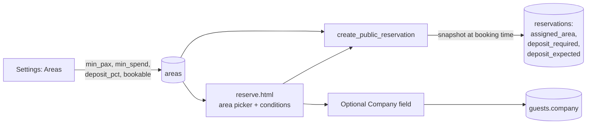

# Phase 1 build spec: area conditions on the booking form

**Status:** spec, not built. Waiting on P1-O1 before coding.
**Repo:** `intoch-gms` only.
**Parent:** `RESERVATION_DEPOSIT_SCOPE.md` (scope closed 2026-09-04).

Phase 1 creates **no new tables** and touches no money. It puts the conditions
the admin currently types into WhatsApp onto the form instead, and snapshots
whether a deposit applies so phase 2 has something to work from.

---

## 1. What changes



---

## 2. Schema

Purely additive. Safe to run during service, safe to run twice.

```sql
alter table public.areas
  add column if not exists min_pax             integer,
  add column if not exists min_spend           numeric,
  add column if not exists deposit_pct         numeric,
  add column if not exists is_bookable_online  boolean not null default false,
  add column if not exists sort_order          integer;

alter table public.reservations
  add column if not exists deposit_required   boolean not null default false,
  add column if not exists deposit_expected   numeric,
  add column if not exists deposit_rule_note  text;
```

### Why `is_bookable_online` defaults to FALSE

`areas` may already contain private rooms, staff zones or areas that are simply
not sold online. Defaulting to true would publish every one of them the moment
the migration runs.

**This collides with the rule inherited from the availability work**, which
says a missing configuration must never silently mean "no bookings". Both rules
are kept by the fallback in section 4: with zero bookable areas the picker is
hidden and the form behaves exactly as it does today. Nothing is ever silently
refused, and nothing is ever silently published.

A test must pin both halves.

### Why the deposit figures are snapshotted onto the reservation

`deposit_expected` is computed at booking time and stored, not derived on read.
If it were derived, editing the minimum spend in settings next month would
silently rewrite what every past booking was told it owed. Same reasoning as
denormalising guest details onto an invoice at issue time.

`deposit_rule_note` records WHY, in one short string: which area rule fired, or
that a staff member waived or added it. This is what makes a waived deposit
distinguishable from one that was never required, which D3 asked for.

### Backfill

Existing reservations get `deposit_required = false` and a null
`deposit_expected`. No historical booking should suddenly look like it owes
money. Existing areas get `is_bookable_online = false` and null conditions,
which is the "behaves as today" fallback.

---

## 3. Settings screen

One row per area in the existing Areas config, gaining:

| Field | Notes |
|---|---|
| Bookable online | Toggle. Off by default |
| Minimum pax | Blank means no minimum |
| Minimum spend | Rupiah. Blank means none |
| Deposit % | Of minimum spend. Blank means no deposit for this area |

**Validation to enforce here, not later:** a deposit percentage with no minimum
spend produces no suggested amount and would send staff an invoice prompt with
a blank figure. Either block the save, or state plainly on the screen that the
suggestion will be blank and staff will type it. Do not let it fail silently at
invoice time.

Rupiah parsing reuses `invParseNum` behaviour: staff type `500000`, `500.000`,
`Rp 500.000` and `500,000` and all four mean the same thing.

---

## 4. Public form

Area picker sits above pax, because pax validity depends on the chosen area.

Each option shows its own conditions in Indonesian, for example:

> **Outdoor Smoking** · min. 4 orang · min. spend Rp 1.500.000 · DP 50%

**Fallback:** if no area has `is_bookable_online = true`, the picker is not
rendered and the form submits with a null area, exactly as today.

**Company field:** one optional text input, labelled for a company booking.
Blank means personal. Writes to `guests.company`.

### Client-side checks, which are convenience only

- pax below the area's `min_pax`
- pax above the area's `capacity`
- area not bookable

Every one of these is re-checked in the RPC. The form is public and anyone can
post whatever they like to Supabase directly, which matters more than usual
while RLS is still off.

---

## 5. `create_public_reservation` changes

New parameters `p_area_id uuid default null` and `p_company text default null`,
both defaulted so any older deployed page keeps working.

New refusal codes, each with ERR_ID copy added **in the same change**, because
the guest page maps an unknown code to "connection problem, try again" and a
guest would retry forever:

| Code | When |
|---|---|
| `area_unavailable` | area id unknown, inactive, or not bookable online |
| `below_min_pax` | pax under the area minimum. Message carries the minimum |
| `over_capacity` | pax above the area capacity |

Order of checks: availability gate first exactly as now, then area, then pax.
A paused restaurant must still refuse before creating a guest row.

On success the function computes and stores the deposit snapshot:

```
deposit_required = area.deposit_pct is not null and area.min_spend is not null
deposit_expected = round(area.min_spend * area.deposit_pct / 100)
```

**Areas are read inside the function, never trusted from the client.**

---

## 6. Edge cases to cover in tests

Throwaway Postgres, mirroring `tests/reservation-availability.test.js`.

1. No bookable area anywhere: form renders no picker, RPC accepts a null area
2. One bookable area: picker renders, null area still accepted from an old page
3. pax below `min_pax` refused with the minimum in the message
4. pax above `capacity` refused
5. Area exists but `is_bookable_online = false`: refused
6. Area with `min_spend` but no `deposit_pct`: booking succeeds, no deposit
7. Area with `deposit_pct` but no `min_spend`: booking succeeds, no deposit, no crash
8. Deposit snapshot stored, then settings changed: the stored figure does not move
9. Company blank stores null, not an empty string
10. Company on an existing guest: does it overwrite? See P1-O2
11. Availability gate still fires before any area check, on a paused restaurant
12. Every code the function can return has an ERR_ID entry

Note the ALL_IN_ONE trap: use `lastIndexOf` and case-insensitive matching when
slicing the function out of the file, since it is redefined more than once.

---

## 7. Open items

### P1-O1. RESOLVED 2026-09-04: booking limits move into settings

`create_public_reservation` hard-codes `p_pax > 20` and a 90-day horizon. Both
are the same family of limit and both move into settings together, so neither
is found again by surprise in three months.

**Decided: both limits apply, whichever is smaller.** A global maximum in
settings acts as the ceiling, and an area can never be booked past its own
`capacity`. With no area chosen (the fallback case) only the global cap applies,
which is why the global one cannot simply be dropped.

New keys, added to the existing `reservation_hours` setting alongside
`min_lead_days` and `online_paused`, which already live there despite not being
hours:

| Key | Replaces | Default |
|---|---|---|
| `max_pax` | the hardcoded 20 | 20, so behaviour does not change on migration |
| `max_days_ahead` | the hardcoded 90 | 90, same reason |

**Both default to today's values on purpose.** A settings migration that also
changes behaviour makes two things true at once and neither can be verified
alone. Rere raises the cap deliberately, afterwards.

**Trap to avoid, already hit once on this key:** `saveThresholdSettings` used to
write `{ open, close }` fresh, which wiped every other field in
`reservation_hours` whenever an unrelated setting was saved. It spreads the
existing value now. Any new save path for these two keys must do the same, and
a test must assert it.

Refusal messages carry the number, so the form can say "maximum 40 people" and
not just "too many".

### P1-O2. Company on a returning guest

An existing guest books again and types a different company, or leaves it
blank. Overwrite, keep the old value, or only fill when empty? The guest-name
rule already in this codebase is "exact phone match reuses the guest, never
renames", which suggests: fill when empty, never blank out an existing value,
and overwrite only from the staff app where a human can see both.

### P1-O4. Does the form check remaining seats per area?

Today nothing checks occupancy on the public form. Staff-side occupancy
already exists (`area.capacity - reserved`). Adding a live per-area
availability check to the public form is genuinely useful and genuinely out of
scope for phase 1. Flagged so it is a decision rather than an oversight.

---

## 8. Deposit flexibility, added 2026-09-04

Rere's requirement, in her words: be as flexible as possible, deposit sometimes
and not others, on the form or over WhatsApp.

**The channel never decides.** A booking made on the form and a booking typed in
by staff from WhatsApp produce the same row, and either can carry a deposit or
not. `reservation_source` records which door was used and nothing branches on
it.

`reservations.deposit_required` is the single truth, seeded from the area rule
at booking time and editable by staff in **both** directions:

| From | To | Allowed |
|---|---|---|
| Rule said none | Staff add a deposit | **Yes, any time.** See P1-O3 |
| Rule said deposit | Staff waive it | Yes, any time, while no invoice is issued |
| Deposit, invoice issued | Switch to no deposit | **Only by voiding the invoice first** |

That last row is decided. The guest is holding a document, so it gets voided
rather than quietly ceasing to exist. `deposit_rule_note` records what happened
either way.

When staff add a deposit by hand, `deposit_expected` is typed, not computed,
because the area may have no rule to compute from.

### P1-O3. Telling a guest about a deposit they were not promised

Staff may add a deposit to a booking the form accepted without one. That is
decided and it is the flexible behaviour Rere asked for. But the guest was
already told none was needed, so this cannot be a silent field change.

Minimum: the app states plainly at the moment of the change that the guest was
not told about this, and the booking gets a follow-up task until the invoice is
sent. What it must never do is add a charge that only surfaces at the table.

**DECIDED 2026-09-04: a confirmation step plus a follow-up task.** Any staff
member may do it, no manager gate. The confirmation states that the guest was
not told about this deposit, and the booking stays on the worklist until the
invoice has been sent.

---

## 9. Auto-issue on submit, decided 2026-09-04

**Decided: when a deposit applies, submitting the public form issues the
invoice, and step 2 hands the guest its link.** Full self-service, no WhatsApp
hop, no waiting for a human.

This is the most exposed thing in the whole project, so the conditions are
written down rather than assumed.

### It does not create the security hole, but it does change its shape

With RLS off, anyone can already insert into `invoices` directly using the
public anon key. Auto-issue does not open that door. What it adds is **volume
through the legitimate path**: a public endpoint that mints numbered financial
documents, at whatever rate someone cares to submit the form.

### Non-negotiables for this to ship

1. **RLS lands first.** This was already phase 0. Auto-issue makes it a
   prerequisite rather than a strong recommendation.
2. **The invoice is created inside the `SECURITY DEFINER` RPC**, in the same
   transaction as the reservation. The public page NEVER inserts into
   `invoices` itself, and the anon role gets no direct write on that table once
   RLS is on.
3. **Rate limiting.** The existing duplicate check in
   `create_public_reservation` catches the same guest submitting twice. It does
   not catch a hundred different phone numbers. A per-phone and per-day ceiling
   is needed before this is public.
4. **`issued_by` records a system sentinel, not null and not a person.** An
   auto-issued invoice must be visibly distinguishable from one a staff member
   sent, or the audit trail quietly lies about who did what.
5. **Numbering must be decided.** See below.

### Numbering, which auto-issue forces

`RESERVATION_INVOICE_SPEC.md` left this open and recommended keeping numbers
hand-typed with a unique index. **Auto-issue makes hand-typing impossible** for
form bookings, so a generated series is now required.

Consequences to accept up front:

- **Gaps are unavoidable.** Bookings get cancelled and invoices get voided, so
  the series will not be continuous. If the restaurant's bookkeeping needs a
  gap-free run, this is the moment that becomes a problem, not later.
- A **separate prefix for auto-issued invoices** (for example `ONL-`) keeps the
  staff-issued series clean and makes the two trivially tellable apart in any
  report.

### Sequencing

Auto-issue is **not** part of phase 2. It needs the invoice table, the public
invoice page and the token to exist first. Realistically it lands with or just
after phase 3, and only once phase 0 is genuinely done.

The informational step 2 page is worth building anyway in the meantime, because
it is what a guest sees while an invoice is still being issued by a person.
