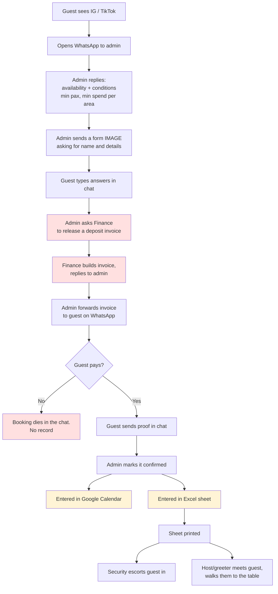
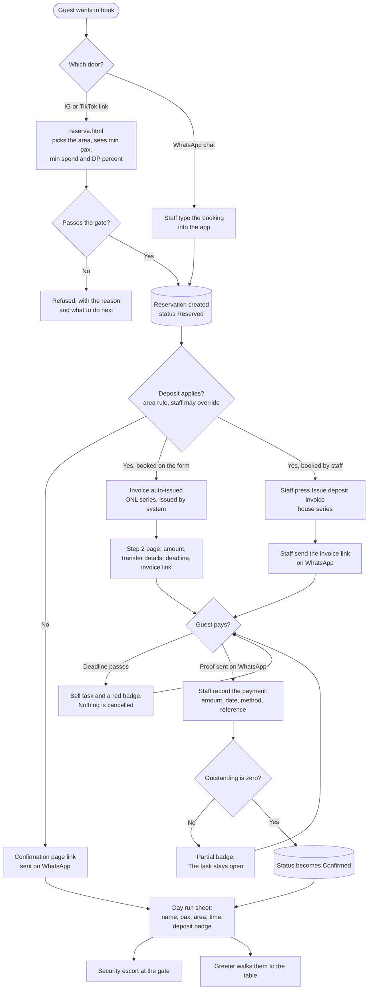
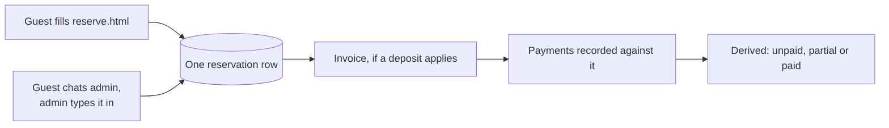
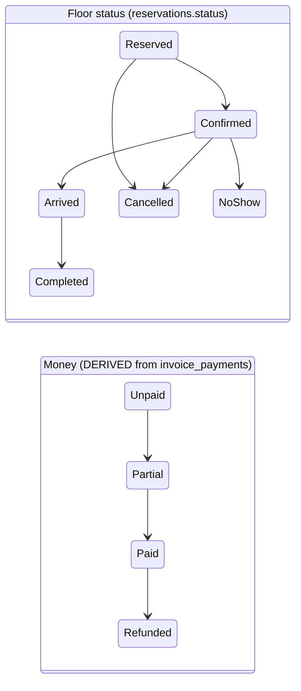

# Reservation with deposit: scoping

**Status:** scoping in progress. Nothing decided yet except where marked.
**Repo:** `intoch-gms` only. Blue Heron is untouched.
**Extends:** `RESERVATION_INVOICE_SPEC.md` (2026-08-23), which already decided the
invoice and payment data model. This document covers the *flow around it*: how a
booking gets a deposit, who releases the invoice, and how the guest sees it.

---

## 1. The story as it works today

A restaurant in Yogyakarta. High traffic, walk-ins are rare, so almost every
cover starts as a reservation.



### Where it actually hurts

| # | Pain | Cost |
|---|---|---|
| 1 | Admin retypes availability and conditions for every enquiry | Admin time, and the answer varies by who is on shift |
| 2 | Guest data arrives as free chat text, then gets retyped | Typos, and the phone number is the one thing that must be right |
| 3 | Admin to Finance and back is a queue with no state | Nobody can answer "where is Ali's invoice" without scrolling a chat |
| 4 | Payment proof lives in a WhatsApp thread | Cannot be reported on, cannot be audited, dies with the phone |
| 5 | Same booking typed into the app, Calendar, and Excel | Three sources of truth, and they disagree |
| 6 | A booking that never pays leaves no trace | No idea how many enquiries are lost, or why |

Pains 1, 2 and 5 are the expensive ones. 3 and 4 are the ones that create
arguments.

---

## 2. What already exists in `intoch-gms`

Worth being precise about this, because the amount of new building is smaller
than the flowchart suggests.

| Piece | State | Where |
|---|---|---|
| Public reservation form | **Built.** Name, phone, pax, date, time, notes | `reserve.html` |
| Availability engine | **Built 2026-09-02.** Min lead days, per-weekday hours, dated closures, pause switch | `reservation_hours_for(date)` |
| Guest-facing confirmation page | **Built.** Public, `?id=`, WhatsApp link preview, status badge | `reservation-confirmation.html` |
| Invoice generator | **Built,** but localStorage only. Items, service, tax, DP line, PDF download | `js/invoice.js` |
| `reservations` table + status enum | **Built.** Reserved / Confirmed / Arrived / Cancelled / No Show / Completed | `ALL_IN_ONE.sql` |
| Reservation Excel export | **Built 2026-09-01.** Five columns | list + dashboard |
| Notification bell / follow-up worklist | **Built** | `js/notify.js` |
| `invoices` / `invoice_items` / `invoice_payments` / `invoice_versions` | **Scoped, not built** | `RESERVATION_INVOICE_SPEC.md` |
| Area conditions (min pax, min spend) | **Does not exist.** `areas` is `id, name, capacity` only | gap |
| Deposit required flag on a reservation | **Does not exist** | gap |
| Public invoice page | **Does not exist** | gap |
| Printable run sheet for security / greeter | **Does not exist** | gap |

So the genuinely new work is five things, not fifteen:

1. Conditions on areas, and showing them on the public form
2. Persisting invoices and linking them to a reservation (already designed)
3. A public invoice page the guest opens from WhatsApp
4. Recording that money arrived
5. A printable day sheet that replaces the Excel and Calendar copies

---

## 3. The flow, final

Replaces the first sketch. This version carries every decision taken on
2026-09-04, including auto-issue on form submit.



The WhatsApp conversation does not disappear. It stops being the *system of
record*. Admin can still do every step on the guest's behalf, which matters
because some guests will never fill a form.

### The gate, in precedence order

Paused, past date, lead time, booking horizon, dated closure, weekly hours,
area bookable, area minimum pax, maximum pax (settings ceiling and area
capacity, smaller wins), then the 30-minute same-day notice. The availability
half of that list is already built and must keep firing first, so a paused
restaurant never creates a guest row for a booking it is about to refuse.

### Two doors, one record



Nothing in the model cares which door was used, beyond `reservation_source`
which already exists.

## 4. The two status axes

This is the part most likely to go wrong, so it is called out on its own.

A reservation today has one `status`. After this change it has two independent
facts, and they can legitimately disagree.



Combinations that are all valid and must not be prevented:

- Confirmed and Unpaid (a regular no-deposit booking)
- Reserved and Paid (deposit arrived, staff have not confirmed the table yet)
- Cancelled and Paid (deposit kept or pending refund, a policy question)
- Arrived and Partial (deposit paid, balance due at the table)

**Guardrail:** do not merge them into one enum, and do not add a
`payment_status` column. `RESERVATION_INVOICE_SPEC.md` already ruled that out
for a good reason. Money state is `sum(payments)` against `invoice.total`,
derived in a view. We have already been bitten once by a single status field
carrying two meanings, on the Blue Heron "Completed" bug.

---

## 5. Decisions needed before anything is built

Numbered so we can answer them one at a time.

### D1. Does the guest pick an area on the public form?

> **DECIDED 2026-09-04: category only.** The guest picks a coarse category
> (indoor / outdoor style), not a specific area. Conditions are shown per
> category. Staff assign the exact area afterwards. This means conditions must
> be defined at CATEGORY level, and `areas` currently has no category column.
> See N1 below.
Today they do not. If conditions are per area, they must, or the admin is still
explaining conditions by hand and nothing improves. Options: guest picks area /
guest picks "indoor or outdoor" only / no pick, staff assign later and the form
just shows minimums for the largest party size.

### D2. What shape are the conditions?
Currently `areas` has only `name` and `capacity`. Candidates to add:
`min_pax`, `max_pax`, `min_spend`, `deposit_amount` or `deposit_pct`,
`is_bookable_online`. Open: do these vary by weekday versus weekend, or by
date? If yes, this becomes a rules table, not columns, and that is a much
bigger build. Recommend starting flat and only splitting if the restaurant
genuinely prices weekends differently.

### D3. What decides that a deposit is required?

> **DECIDED 2026-09-04: rule with staff override.** Driven by category and pax,
> overridable per booking. Record which one applied, so a waived deposit is
> distinguishable from one that was never required. Amount shape is still open,
> see N2.
Options: a rule from the area plus pax, a manual toggle by staff, or a rule
with staff override. Recommend rule with override, and record which one applied
so the report can tell a waived deposit from a booking that never needed one.

### D4. Who may issue the invoice, and does Finance still gate it?

> **DECIDED 2026-09-04: either, by role.** No hard Finance gate. Whoever holds
> the permission may issue, and `issued_by` is recorded on the invoice. The
> restaurant decides who gets it, which also makes this sellable to a client
> with no Finance function at all. Note: `staff_users.role` today is only
> `staff` / `manager` / `admin`. See N3.
The story has Finance releasing it. If admin can now issue it directly, that is
a real change to a business control, not a UI detail. Options: anyone with the
right role issues it, or admin drafts and Finance issues. The second keeps the
control and keeps the queue. Needs a decision from the business, not from us.

### D5. What does the guest actually see at the invoice link?

> **DECIDED 2026-09-04.** Amount due, what it is for, booking date and time,
> area, transfer details, payment status, and the itemised lines when a
> pre-order was typed. **Never** the guest's phone number, and never any
> reference to another booking or another guest. One token, one invoice.
Minimum: amount due, what it is for, the date of the booking, bank transfer
details, and current status. Open: does it show the itemised pre-order, and
does it show anything about other bookings by the same guest? It must not.

### D6. How does payment get recorded?
v1 recommendation: staff key it in from the WhatsApp proof. A guest upload of a
transfer screenshot means file storage, a review queue and a moderation
problem, for the same end state. Worth doing later, not first.

### D7. Is there a deposit deadline, and what happens at it?

> **DECIDED 2026-09-04: flag it, staff decide.** Bell task plus a red badge on
> the row. Nothing automatic, no auto-cancel, no auto-release of the table. How
> the deadline itself is set is still open, see N4.
Recommendation: a deadline that produces a bell task and a red badge, and
nothing else. Auto-cancel is tempting and dangerous, because a bank transfer
lands at 23:50 and the guest arrives to a cancelled table.

### D8. What happens to a deposit when a booking is cancelled?

> **DECIDED 2026-09-04: track the resolution, do not enforce a policy.**
> Cancelling a booking that holds money asks what happens to it, and the app
> records the answer and whether it has actually been settled. A human does
> the real refund and confirms it.
>
> Proposed shape, mostly derived so it cannot drift:
>
> - **Refund pending** is DERIVED: reservation is Cancelled and `paid > 0`.
>   No column. It produces a bell task like any other outstanding item.
> - **Refunded** is evidenced by a **negative payment row**, which the model
>   already supports, carrying amount, date, method and reference. Once it
>   lands, `paid` returns to zero and the task clears itself. Same principle
>   as never offering a 'mark as paid' tick: the money movement is the record.
> - **Forfeited** is the one case nothing can derive, because the money simply
>   stays. That needs one nullable field on the reservation,
>   `deposit_resolution` in (`pending`, `refunded`, `forfeited`, `credit`),
>   set at cancellation. Without it a kept deposit looks like a refund nobody
>   ever got round to.
>
> `credit` is recorded as an intention only. The app has no concept of moving
> money between bookings and this scope does not add one.
Kept, refunded, or held as credit. This is restaurant policy and it differs per
client. The app should record what was done, not enforce a rule. But somebody
has to write the policy down for Blue Heron, because staff will be asked.

### D9. What replaces the Google Calendar and the Excel sheet?

> **DECIDED 2026-09-04: the minimum sheet.** Name, pax, area, time and a
> deposit badge. No vehicle plate, no guest phone number on a printed sheet
> that circulates around the property. Built so columns are easy to add if
> security later asks for more.
The Excel export already exists. Missing is the printed run sheet. Open: what
does security actually need on it? Name, pax, area, arrival time and a deposit
badge, plus possibly a vehicle plate, which is a field we do not have. Ask
security before designing the sheet, not after.

### D10. Does the reservation form need a Company field?

> **DECIDED 2026-09-04: yes, optional, in phase 1.** For guests booking on
> behalf of a company. Blank means a personal booking. Writes to
> `guests.company`, which already exists and is already indexed. Makes the
> invoice Bill To fill itself instead of being retyped out of the Notes.
`guests.company` exists and the form never asks. One optional field makes the
invoice's Bill To fill itself. Cheapest single improvement in this whole
document.

---

## 6. Guardrails

1. **RLS is still off.** The anon key is public in the deployed JavaScript, so
   with RLS disabled anyone who views source can read every table and write to
   it. Adding invoices and payments puts financial records behind that same
   open door, including the ability to write a fake payment row. This should
   land with the feature or before it. It is already the item blocking the
   first sale.

2. **The public invoice link needs an unguessable token,** not the invoice
   UUID and absolutely not the invoice number. Sequential numbers mean guest
   number 41 can read invoice 40. One page, one invoice, no guest phone number
   on it.

3. **An issued invoice that gets edited stops matching the PDF already in the
   guest's WhatsApp.** The version trail and the "edited after issue" marker
   are not optional polish. Ship them with editing, or keep issued invoices
   frozen until they exist.

4. **No "mark as paid" tick.** Recording the payment is what clears the task.
   A tick would be a second truth competing with the arithmetic.

5. **Denormalise guest details onto the invoice at issue time.** If Ali later
   drops from 30 pax to 25, the invoice he already holds still says 30.

6. **Deposit money is not `visits.spend_amount`.** They are different facts and
   must never be summed together in a revenue figure.

7. **Do not auto-cancel on non-payment.** See D7.

8. **Existing reservations backfill as "no deposit required"** so no historical
   row suddenly looks unpaid.

---

## 7. Suggested build order

**Revised 2026-09-04** after the decisions above. Each phase is shippable alone.

| Phase | What | Note |
|---|---|---|
| 0 | RLS, or an explicit written decision to accept the risk again | now carries invoices and payments |
| 1 | Conditions as columns on `areas`, area picker on the public form, optional Company field | no new tables |
| 2 | `invoices` + `invoice_items` + `invoice_versions`, issued from a booking, `finance` role added | versions ship HERE, see N3 |
| 3 | Public invoice page with an unguessable token | guardrail 2 |
| 4 | `invoice_payments` + balances view + row badge + Confirmed on full payment | D3, N5 |
| 5 | Deadline, bell tasks, refund-pending task, outstanding report | N4, D7, D8 |
| 6 | Printable day run sheet, retiring the Calendar and Excel double entry | D9 |

**Phase 6 depends on none of the money work** and removes the most daily
minutes. It is a candidate to pull forward if the restaurant is impatient.

**Phase 2 changed.** `invoice_versions` used to be last because it is small.
Now that any staff member can issue an invoice, the audit trail is the only
control that exists, so an editable issued invoice without version history
would be a hole with no compensating boundary.

## 8. Follow-on questions opened by the 2026-09-04 decisions

### N1. What are the categories, and where do conditions live?

> **RESOLVED 2026-09-04: there is no separate category. `areas` ARE the
> categories.** Indoor, Outdoor, Outdoor Smoking, Indoor Smoking and so on
> are already rows in `areas`. No new table, no new grouping level.
>
> This also **revises D1 back to 'the guest picks the area'**, because at this
> restaurant an area already IS the coarse choice a guest can sensibly make.
> The distinction only mattered while we assumed areas were individual
> physical zones sitting under a broader label.
>
> Conditions therefore go as columns on `areas`: `min_pax`, `min_spend`,
> `deposit_pct`, `is_bookable_online`. Simplest possible shape, and it means
> the number shown on the form is the number that applies to the area booked,
> with no mismatch risk at all.
>
> Still worth confirming: `tables` already references `areas(id)`, so a
> specific table is assigned within the chosen area as it is today.
D1 chose "category only", which introduces a concept the schema does not have.
`areas` is `id, name, capacity`. Needed: a category per area, and the
conditions attached to the **category**, not the area, since that is what the
guest sees before booking.

Open: what are the real categories at this restaurant, and can one category
hold areas with genuinely different minimums? If it can, the guest is shown a
number that is wrong for the area they end up in, and we should reconsider D1.

### N2. What shape is the deposit amount?

> **DECIDED 2026-09-04: percentage of the minimum spend.** Both the minimum
> spend and the deposit percentage are editable in settings, per category. The
> figure that reaches the invoice is a SUGGESTION and stays editable there.
> Consequence: a category with no minimum spend can produce no suggested
> deposit, so settings must either require a minimum spend on any category that
> can take a deposit, or fall back to a flat amount.
Candidates: a flat rupiah figure per category, a per-head figure multiplied by
pax, or a percentage of the category's minimum spend. Whichever is chosen is
only the **suggested** figure. It must stay editable on the invoice, because
`RESERVATION_INVOICE_SPEC.md` already established that payment terms vary per
restaurant and per booking.

### N3. Which role may issue an invoice?

> **DECIDED 2026-09-04: add a `finance` role.** Access resembles `staff`,
> plus the invoice and payment permissions. `admin` and `manager` hold the
> same invoice permissions, so they can change things without waiting for
> Finance. Nobody is a bottleneck.
>
> Touches: the `staff_users_role_check` constraint (today `staff`,
> `manager`, `admin`), the role label helper in `app.js`, and the staff
> config screen.
>
> **AMENDED 2026-09-04: plain `staff` CAN issue invoices and record
> payments.** So the `finance` role is a naming and reporting label, not a
> permission boundary. Rere accepted that knowingly; front desk needs to key
> in money that arrives out of office hours.
>
> **Consequence, and it is not a small one.** With no permission boundary, the
> ONLY control over who sends a financial document to a customer is the audit
> trail: `issued_by`, `recorded_by`, and the version history. That moves
> `invoice_versions` out of 'phase 7, it is small' and into 'ships with the
> invoice table'. See the revised build order.
D4 chose "either, by role", but `staff_users.role` only allows `staff`,
`manager` and `admin`. Options: reuse `manager` and above, or add a `finance`
role. Adding a role touches the staff config screen and the role check helper.

### N4. How is the deadline set?

> **DECIDED 2026-09-04: N hours from issue, capped at the booking date.** The
> deadline is `min(issued_at + N hours, day before the booking)`. N lives in
> settings. Edge case to handle: a booking made for TODAY or tomorrow, where
> the cap is already in the past. Rule for that: the deadline becomes the
> booking time itself, never a moment already gone.
Options: a fixed number of hours or days from issue, set once in settings; a
date staff type per invoice; or "the day before the booking". Note that a
booking made for tomorrow and a booking made for next month need different
answers, so a single global number will be wrong at one end.

### N5. Does a fully paid deposit flip the status to Confirmed by itself?

> **DECIDED 2026-09-04: yes, one step.** Recording a payment that clears the
> outstanding balance moves the reservation from Reserved to Confirmed.
> Rere first read this as 'can the app detect a payment'. It cannot, and does
> not try: a human always keys the payment in. The decision is only about
> whether that same act also confirms, and it does.
>
> **One-way only.** Deleting a payment, editing it downward, or recording a
> refund NEVER drags the status back to Reserved. Staff may have confirmed the
> table for a reason the app does not know, and silently un-confirming a
> booking is how a guest arrives to no table.
>
> Only Reserved is promoted. A Cancelled, Arrived or Completed booking that
> receives a payment stays where it is.
Recommended yes, because otherwise a paid booking sits at Reserved and someone
has to remember. But the reverse must NOT happen: an unpaid or refunded
deposit never drags the status backwards, since staff may have confirmed the
table for a reason the app does not know.

### N6. Staff key in the payment, or does the guest upload proof?

> **DECIDED 2026-09-04: staff key it in.** Guest sends proof on WhatsApp as
> today. Staff enter amount, date, method and reference. No file storage, no
> review queue. Guest upload stays on the shelf as a later phase.
Recommendation stands from D6: staff key it in for v1. Guest upload means file
storage, a review queue and a moderation problem, for the same end state.

---

## 9. Scope closed 2026-09-04

Every decision D1 to D10 and N1 to N6 is answered. The phase 1 build spec is in
`RESERVATION_DEPOSIT_PHASE1.md`.

One finding surfaced while writing that spec and it changes phase 1's shape:
**`create_public_reservation` hard-caps pax at 20** and tells anything larger to
contact WhatsApp. The deposit feature exists mainly for large groups. As it
stands, the exact bookings that need a deposit are the ones the form refuses.
See phase 1, open item P1-O1.

---

## 10. Invoice types, and linking the generator, decided 2026-09-04

Rere raised what looked like two invoice formats: the deposit invoice for a
general booking, and the detailed one for a buffet or a package, which is what
`js/invoice.js` already produces.

**Decided: one format.** The generator's fields already cover both. A buffet
invoice is that sheet with several line items. A deposit invoice is the same
sheet with one line and the DP block switched on. Two templates would mean two
code paths, two sets of bugs, and a third template the first time somebody
wants a deposit on a buffet booking, which is the Ali case the invoice spec was
written around.

What genuinely differs is the **document type**, not the layout. Locally these
are two documents a guest receives at different moments: the DP invoice and the
settlement invoice. That is one field.

```
invoices.doc_type in ('deposit', 'settlement', 'full')
```

It controls the printed title and whether the DP block prints. Nothing else.

### Many invoices per booking

**Decided: yes.** `reservation_id` was already nullable and many-to-one in the
August spec. A booking normally carries a deposit invoice and later a
settlement invoice, and may also carry a voided one beside its replacement.

The reservation row badge therefore reads from **non-void invoices only** and
shows the SUM when there is more than one. A badge that silently picked the
first invoice would report a fully settled booking as half paid, or worse, the
reverse.

### The generator gains three ways in

| Entry | Prefilled from | Case |
|---|---|---|
| From a booking | bill-to, event date, pax, area | The buffet. Staff type the lines |
| Standalone, as today | nothing | Large takeaway with no booking behind it |
| Automatic on form submit | everything, one line | The deposit, ONL series |

Two details that will bite if skipped:

1. **Link to booking, after the fact.** Staff will make a standalone invoice
   first and remember the booking afterwards. Without a search-and-link on an
   existing invoice they will retype it, and the copy is what ends up
   disagreeing.
2. **Remove the `localStorage` last-five history.** The moment invoices live in
   the database, that list is a second source of truth showing whatever
   happened to pass through one browser. Leaving it is how somebody reprints a
   version that no longer exists.

---

## 11. The shareable invoice link, and the refactor it needs

Rere asked whether the generator could be attached as a link to preview, rather
than only downloading a PDF. Yes. That is phase 3, and it removes the last
manual hop in the original story, where the admin forwards a PDF that Finance
sent them.

### Mechanism

`invoice.html?t=<token>` loads one invoice and its items through a
`SECURITY DEFINER` function that takes the token and returns that invoice
alone. The token is random and unguessable, never the invoice number and never
the row id.

The guest can still download the PDF from that page. The link is an addition,
not a replacement.

### The blocker nobody would notice until they hit it

**`invRenderPreview()` reads the form inputs directly** via `invVal("inv-name")`
and friends, and writes into `#inv-sheet`. It is not a function of a snapshot;
it is a function of the DOM of the staff page. The public page has no such
form.

So this needs a refactor before it can work: `invRenderPreview(snapshot)` takes
the data as an argument, and the staff page passes `invSnapshot()` into it. One
renderer then serves three surfaces, the staff preview, the PDF, and the guest
page.

The alternative, a second renderer for the public page, is exactly the failure
this codebase has already taken an outage from. Two functions that must agree
and have no mechanism forcing them to will drift, and the version the guest
sees is the one that matters.

`invApplySnapshot()` already exists and does the reverse, so the snapshot shape
is settled. This is a contained change, not an unknown.

### The honesty problem a live link creates

A PDF the guest downloaded is frozen. A link renders whatever the invoice says
now. Edit the invoice and the guest's link silently changes underneath them,
while their PDF does not.

The page must therefore carry the issue date, and where a version exists beyond
the first, say **updated on <date>** plainly. Same requirement as the
edited-after-issue marker, applied to the surface the guest actually looks at.

### Two smaller things

- **The WhatsApp link preview must not carry the amount or the guest's name.**
  `reservation-confirmation.html` already stamps absolute `og:` tags from
  `SITE_URL` at build time, so the mechanism exists. But a preview card renders
  wherever the link is forwarded, and an invoice total sitting in a group chat
  is a leak. Restaurant name and the word Invoice, nothing else.
- **The generator's subtitle becomes false.** It currently reads "nothing is
  saved to the system", which is accurate today and will not be. Change it in
  the same commit that adds saving, not afterwards.

---

## 12. Build order, agreed 2026-09-04

Not all at once. The argument is this project's own history: the spending-tier
showstopper was only found by reproducing migrations on a real database, the
ALL_IN_ONE run passed twice on an empty DB before aborting on a seeded one, and
the reservation bell took five rounds. Each was caught because the change was
small enough to isolate. RLS in particular touches every table, so bundling it
with new tables makes a policy failure and a new-table bug look identical.

**Cadence: two phases per session.** Two exceptions that ship alone, whatever
else is queued: **RLS** and **auto-issue on submit**.

| Order | Work | Why here |
|---|---|---|
| 1 | **Day run sheet** | Depends on nothing, touches no money, kills the Calendar and Excel double entry |
| 2 | Phase 1: area conditions, limits into settings, Company field | Foundation for the deposit rule, no new tables |
| 3 | `invRenderPreview` refactor, **alone** | A pure refactor with no behaviour change is far safer unbundled from the feature needing it |
| 4 | RLS, **alone** | |
| 5 | Invoices, items and versions, issued from a booking | |
| 6 | Public invoice page with a token | |
| 7 | Payments, balances view, row badge, confirm on paid | |
| 8 | Deadline, bell tasks, refund pending, outstanding report | |
| 9 | Auto-issue on submit, **alone** | |

### The trap in shipping phase 1 before phase 5

Phase 1 makes the form announce a deposit that nothing can yet raise an invoice
for. Staff would fall back to the standalone generator, which is exactly today's
behaviour, so it is survivable. The clean handling is to **leave
`is_bookable_online` off until the invoice work lands**, so the form keeps
behaving as it does now while the settings quietly fill up.

---

## 13. Day run sheet, decided 2026-09-04

Replaces the Google Calendar entry and the printed Excel sheet.

**A finding that justifies building it rather than adding columns to the
export:** `RES_EXPORT_HEADERS` is `Name, Phone Number, Date Time, Notes,
Status`. It carries **no area and no pax**, which are the two things security
and the greeter need most. That gap is very likely why the Calendar copy exists
alongside the spreadsheet.

| Decision | Chosen |
|---|---|
| Order | **Time order**, with an **area summary block at the top** showing expected covers per area. Serves the gate and the floor from one sheet |
| Language | **Follows the app language.** Consistent with everything else |
| Columns | Time, name, pax, area, **table when assigned**, **notes**, deposit badge |
| Excluded | Phone number, and any vehicle plate. A printed sheet circulates around the property |
| Occasion | Left off at Rere's call. It is the structured version of what staff usually type into Notes anyway, and it is one line to add if greeters ask |

Statuses excluded from the sheet: Cancelled, Cancelled (No Show), No Show and
Deleted. An empty day must still render a usable sheet with the date on it, not
a blank page.

The deposit badge is a placeholder until the payment work lands. The sheet is
built so the column exists and fills itself later.
