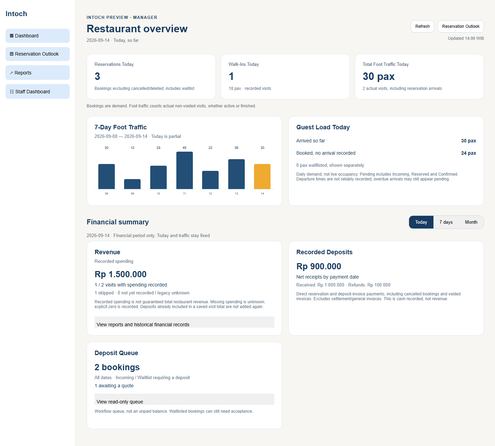
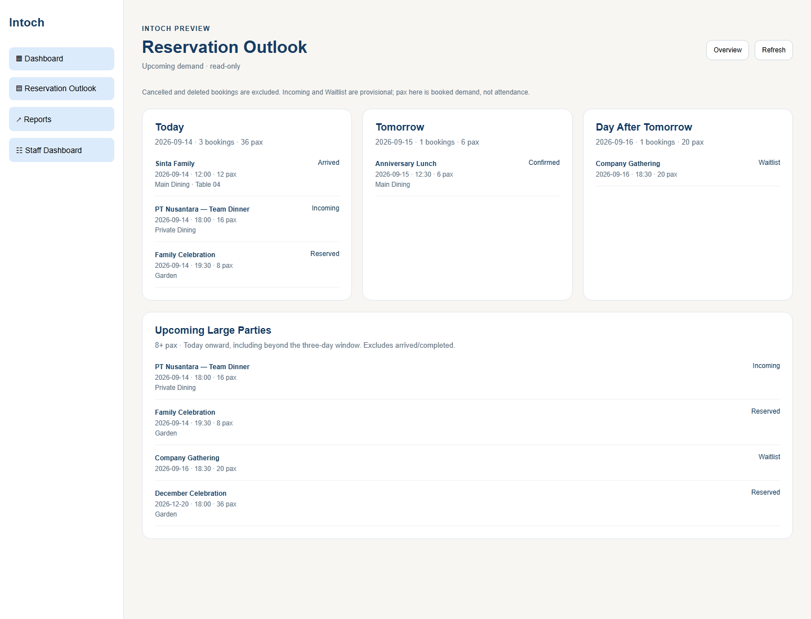

# Management dashboard and Reservation Outlook

Implemented locally on 2026-09-14 from clean `main` at `65a2a1b`. No push,
deployment, live SQL or production configuration changes were performed.

## Screens and roles

Owner, Admin and Manager land on Restaurant overview. Owner remains read-only.
Admin/Manager retain Staff Dashboard and all existing operational permissions.
Staff and Finance retain their existing dashboards and cannot open Reservation Outlook.
The dashboard/outlook contain no reservation, visit or payment mutation controls.
Database authorization remains the existing verified-role RLS and protected RPCs.

Dashboard order: Today KPIs, seven-day traffic and Guest Load, then financial summary.
The financial period selector (Today / trailing seven days / month to date) affects
spending and recorded deposits only. Today KPIs and the seven-day chart stay fixed.

Reservation Outlook is a separate menu with Today, Tomorrow, Day After Tomorrow,
and Upcoming Large Parties. Rows show booking/guest name, date, time, pax, status,
assigned area and primary table when available. It is read-only for every role.

## Exact definitions

| Metric | Definition |
|---|---|
| Reservations Today | Bookings dated today, excluding soft-deleted, Deleted, Cancelled, Cancelled (No Show), and No Show. Includes Incoming, Waitlist, Reserved, Confirmed, Arrived and Completed. This is demand, not attendance. |
| Walk-Ins Today | Count of actual non-voided visits with `visit_type = 'Walk-In'` dated today; also shows their summed pax. |
| Total Foot Traffic Today | Sum of pax on non-voided visits dated today. Includes active and finished visits, reservation arrivals and walk-ins. Bookings are never added to visits. Today's future-timed visits are excluded until their recorded time; legacy missing time is included. |
| 7-Day Foot Traffic | Same visit-pax definition for today and the preceding six calendar dates, including empty days. Today is labeled partial. |
| Guest Load Today | Arrived pax from today's visits, plus a separately displayed pending-pax figure for today's Incoming/Reserved/Confirmed bookings without a matching visit. Waitlisted pax is separate. No combined attendance/forecast total or occupancy percentage. |
| Revenue / Recorded spending | Sum of non-null `visits.spend_amount` in the selected visit-date period. Explicit zero counts as recorded. Coverage shows recorded visits / all visits, skipped-null visits and other unknown-null visits separately. With no recorded visits, amount is an em dash. No deposit is added to saved spending. |
| Deposit Queue | All-date Incoming/Waitlist bookings with `deposit_required = true`, excluding deleted bookings. Shows booking count and count with no positive quote. A workflow queue, not an outstanding-balance calculation; may include bookings needing acceptance. |
| Recorded Deposits | Net `invoice_payments.amount` by `paid_on` in the selected financial period: direct reservation payments plus payments linked to reservation deposit invoices. Refunds reduce net receipts. Cancelled bookings and subsequently voided invoices retain their money. General and settlement invoices are excluded. Positive receipts and refunds are also shown separately. |
| Upcoming Large Parties | Today and all later dates, pax at least the restaurant threshold, status Incoming/Waitlist/Reserved/Confirmed, excluding deleted bookings. Includes bookings beyond the three-day panels; overlaps those panels deliberately. |

Calendar labels retain the existing overview's Jakarta timezone. `ymd()` handles
calendar shifting. A reservation's Completed status alone never proves arrival.
Capacity data has areas, active tables, seats and timed holds, but staff closeout
does not reliably establish guest departure. Guest Load therefore makes no live
seating or occupancy claim. Pending bookings can include overdue/no-show records
until staff resolve them; Arrived/Completed bookings without visits are not invented
as arrivals or pending guests.

## Configuration and financial history

Settings > Thresholds now has a separate Reservation Outlook threshold, default 8 pax.
Admin/Manager can save integers 1–500 in `app_settings.management_dashboard.large_party_pax`.
Writes require returned rows and the existing settings RLS. Owner cannot save.
This setting deliberately does not alter existing deposit large-party flags,
deposit pax bands, online max pax, prices or capacity enforcement.

With Deposit Tracking disabled, both dashboard deposit widgets and their queries
are absent. With Spending Tracking disabled, Revenue remains visible with an
explanation. Historical Spending Insights remains accessible.

Reports > Operations > Recorded financial history is an on-demand read-only
summary using the Operations date range. It remains available with either toggle
disabled and shows spending coverage and net deposit receipts separately. It is
not loaded automatically alongside existing report queries. Reload it after changing
the range; the displayed result always identifies the dates actually loaded.
Historic money is neither removed nor rewritten when settings change.

## Implementation and SQL

- `js/owner-dashboard.js`: paginated data reads, metrics, rendering, outlook,
  threshold settings and financial-history summary.
- `js/app.js`: management routing, existing refresh integration, logout invalidation,
  threshold rendering and historical report access.
- `js/config.template.js`: page gates and Indonesian strings; generated config untouched.
- `index.html`, `css/owner-dashboard.css`: menu, sections, responsive layout and cache versions.
- `tests/owner-dashboard.test.js`, `tests/staff-auth-roles.test.js`,
  `tests/role-enforcement.test.js`: behavior, route and database permission coverage.
- `scripts/capture-management-preview.cjs`, `docs/screens/management/`: isolated visual fixture.

No new migrations, views, RPCs, grants or Edge Functions. Reads use `visits`,
`reservations` (guest and primary-table joins), `invoice_payments` and `invoices`.
Rows paginate in 500-row batches, invoice lookups in 150-ID chunks. Missing invoice
classification fails the summary rather than silently undercounting receipts.
Overview no longer loads guest lifetime histories or spending leaderboards.
Requests reject results/errors from old routes, request generations or staff sessions.

## Verification and limits

Passed targeted checks:

- Management dashboard tests under Asia/Jakarta, UTC and Pacific/Kiritimati:
  actual attendance, cancelled/deleted/void exclusion, duplicate-count prevention,
  zero/skipped/unknown coverage, refund and void-invoice treatment, all toggle combinations,
  far-future parties, configurable threshold, paging, empty/error states, escaping,
  Indonesian rendering, stale sessions/navigation, history and all dashboard route variants.
- Staff Auth role navigation and Financial Tracking tests.
- Role enforcement and role membership/report PGlite tests. The new setting was
  exercised as Manager with returned rows, readable as Owner, and denied for Owner/Staff writes.
- Operations report loading, dashboard reservation rows, page loading and realtime lifecycle.
- `node --check` for affected application scripts and capture script; `git diff --check`.

Full `npm test` was not run; known unrelated failures remain documented in CURRENT_STATE.
PGlite/jsdom cannot prove a client's live Auth, RLS deployment, Realtime or data quality.
Screenshots use real management components with synthetic rows and an isolated shell,
not a logged-in client. Chrome exact-viewport checks covered 1440px desktop and 390px
mobile, including disabled tracking in Indonesian, without horizontal overflow.
The in-app browser tool failed before initialization; local headless Chrome was used.
Primary table only is shown in outlook; this is not a full table-assignment editor.
Future large parties and the all-date deposit queue load all matching rows with pagination;
very large datasets may warrant a measured aggregation/paging optimization later.

## Rollout and commit

1. Verify the target client's existing secured migration state. This feature requires
   the existing Financial Tracking columns (`20260919_financial_tracking.sql`);
   current frontend also retains the existing arrival dependency (`20260920_reservation_arrival.sql`).
   Follow `migrations/README.md` for missing prerequisites; do not rerun bootstrap/security SQL.
2. No feature-specific SQL or Edge Function rollout is needed.
3. Build with the real client's existing variables, then deploy frontend only when authorized.
4. Smoke-test Owner/Manager navigation, disabled toggles/history, large-party settings,
   representative receipts/refunds and existing Staff/Finance operations in that environment.

Safe to commit this focused change after review; not a claim of production readiness
without the client smoke checks. Nothing was committed automatically.

Suggested commit: `feat: add management dashboard and reservation outlook`

## Previews

Synthetic data, not production restaurant figures.

Mobile: [dashboard](screens/management/dashboard-mobile.png),
[outlook](screens/management/outlook-mobile.png),
[tracking disabled in Indonesian](screens/management/tracking-disabled-mobile.png).
